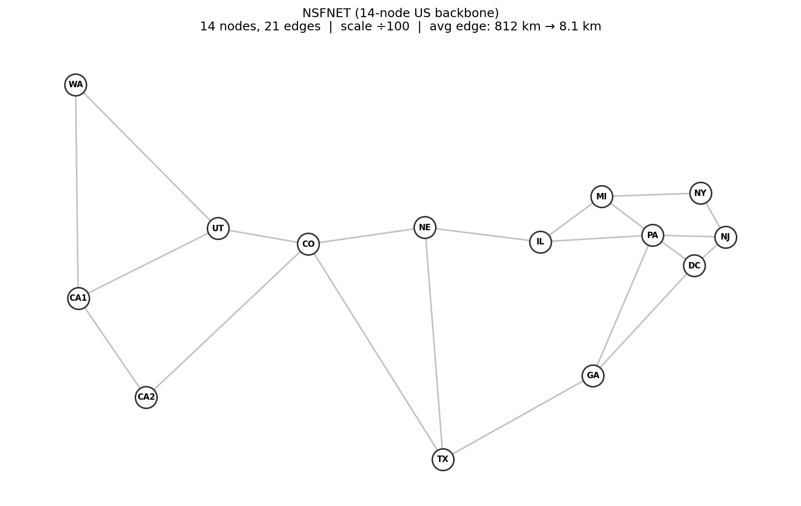
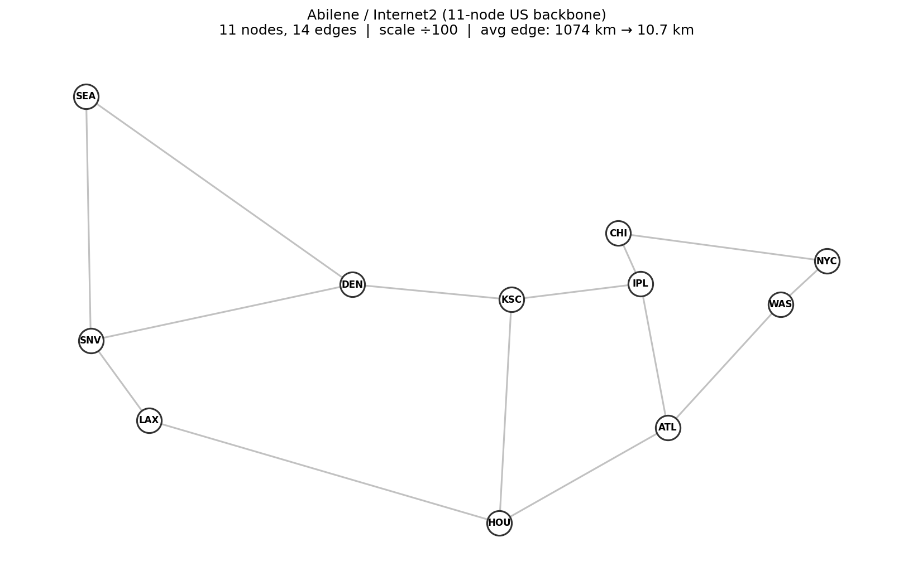
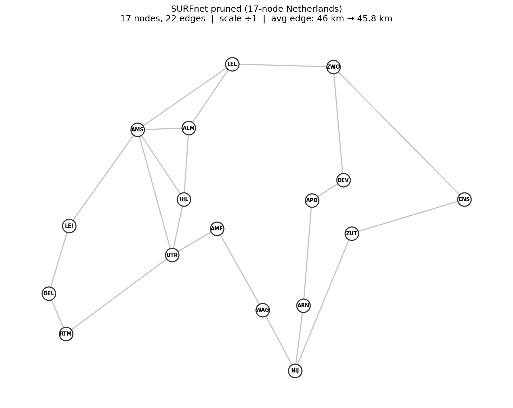
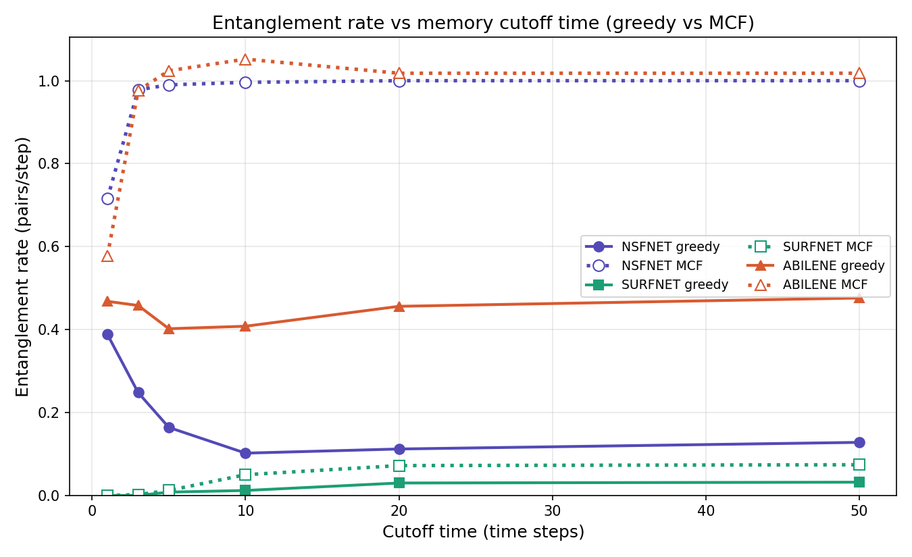
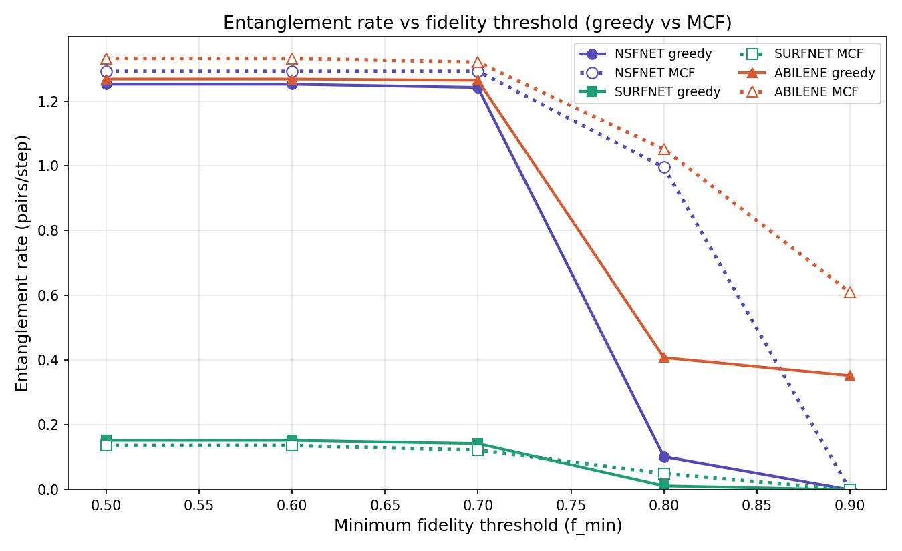
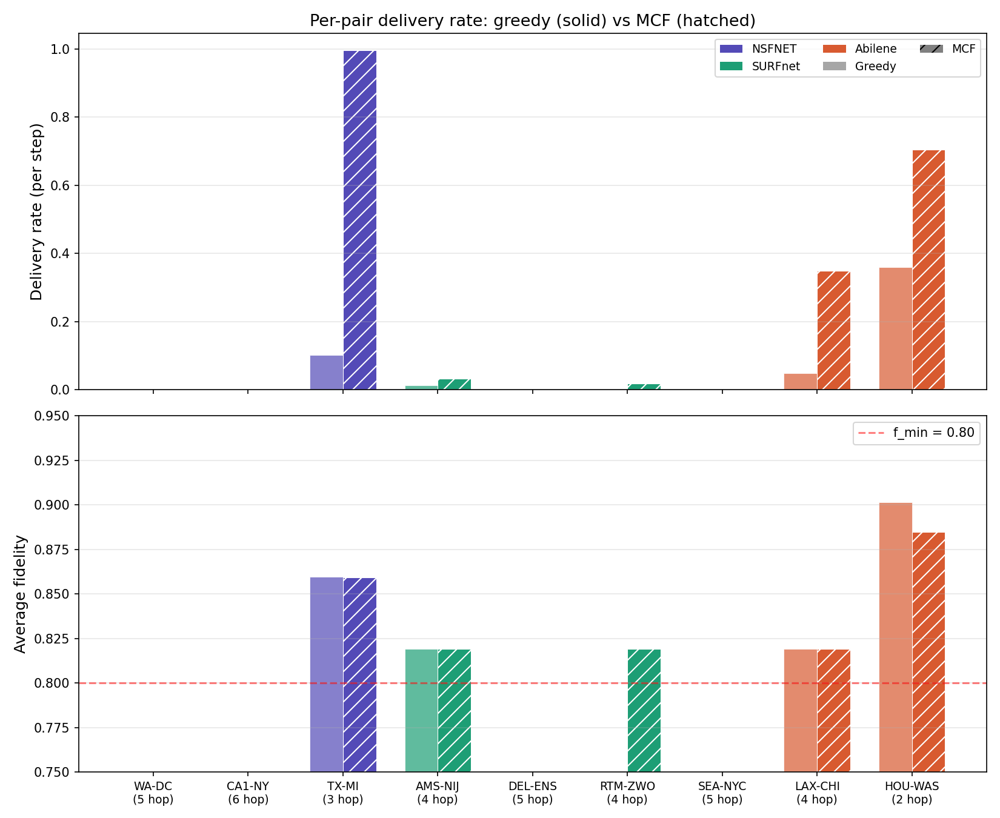

# Quantum Network Entanglement Routing Simulator

A discrete-time simulator for multi-user entanglement routing over quantum networks, comparing greedy shortest-path routing against multi-commodity flow (MCF) optimization.

Built as an extension of [Vardoyan et al. (IEEE TQE 2024)](https://arxiv.org/abs/2307.04477) from single-pair to concurrent multi-user routing.

## Topologies

| | |
|:---:|:---:|
|  |  |
| NSFNET (14 nodes, 21 edges) | Abilene (11 nodes, 14 edges) |

| |
|:---:|
|  |
| SURFnet pruned (17 nodes, 22 edges) |

## Key Results





MCF consistently outperforms greedy on link-rich topologies (NSFNET, Abilene scaled ÷100) by avoiding wasteful routing on long undeliverable paths. On resource-scarce SURFnet (unscaled), greedy is competitive since MCF's global optimization spreads scarce links too thin. Hop count is the dominant bottleneck: paths beyond 4 hops cannot meet F_min = 0.80 with F_init = 0.95 under the depolarizing swap model.

## Quick Start

```bash
# Install
pip install -e .

# Run a simulation
python main.py -t nsfnet -a greedy --distance-scale 100 -T 500 -o results/nsfnet_greedy.json
python main.py -t nsfnet -a mcf --distance-scale 100 -T 500 -o results/nsfnet_mcf.json

# Generate topology diagrams
python scripts/plot_topologies.py

# Generate all comparison plots
python scripts/plot_results.py

# Run tests
pytest tests/ -q
```

## Project Structure

```
quantum_routing/
├── quantum_routing/
│   ├── network.py              # QuantumNetwork: topology + link state
│   ├── simulation.py           # Main simulation loop
│   ├── algorithms/
│   │   ├── greedy_shortest_path.py
│   │   └── multi_commodity_flow.py
│   ├── topologies/
│   │   ├── nsfnet.py
│   │   ├── surfnet.py
│   │   └── abilene.py
│   └── utils/
│       ├── config.py
│       └── fidelity.py
├── scripts/
│   ├── plot_topologies.py
│   └── plot_results.py
├── tests/
├── paper/
├── main.py
└── README.md
```

## Parameters

| Parameter | Default | Description |
|-----------|---------|-------------|
| `L_att` | 22 km | Fiber attenuation length |
| `p_gen_base` | 1.0 | Base generation probability |
| `T_cut` | 10 | Memory cutoff (time steps) |
| `F_init` | 0.95 | Initial Bell pair fidelity |
| `F_min` | 0.80 | Minimum delivery fidelity |
| `q_swap` | 1.0 | Swap success probability |

## References

- Vardoyan et al., "On the Bipartite Entanglement Capacity of Quantum Networks," IEEE TQE 2024 ([arXiv:2307.04477](https://arxiv.org/abs/2307.04477))
- Pouryousef et al., "Resource Placement for Rate and Fidelity Maximization in Quantum Networks," IEEE TQE 2024 ([arXiv:2308.16264](https://arxiv.org/abs/2308.16264))
