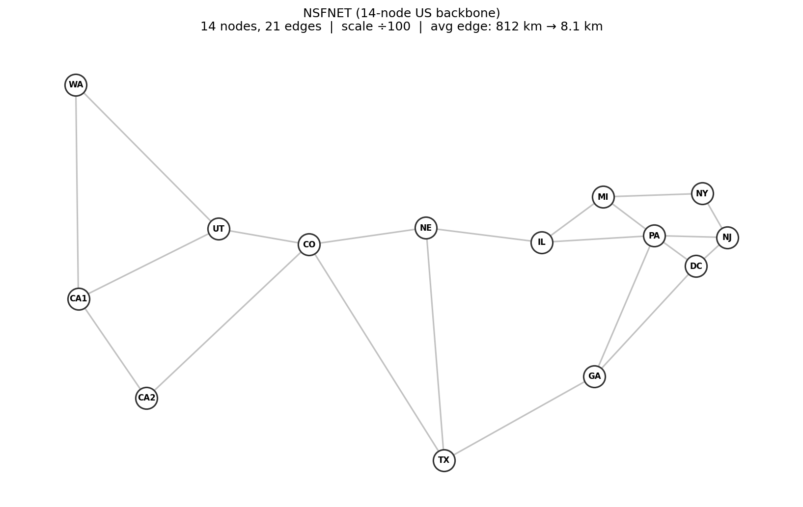
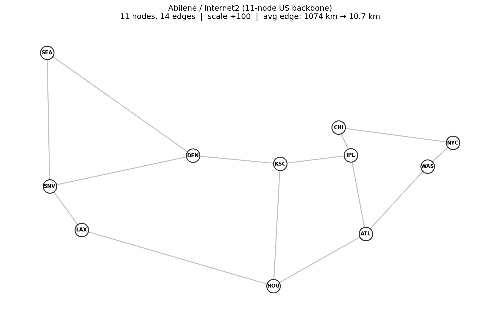
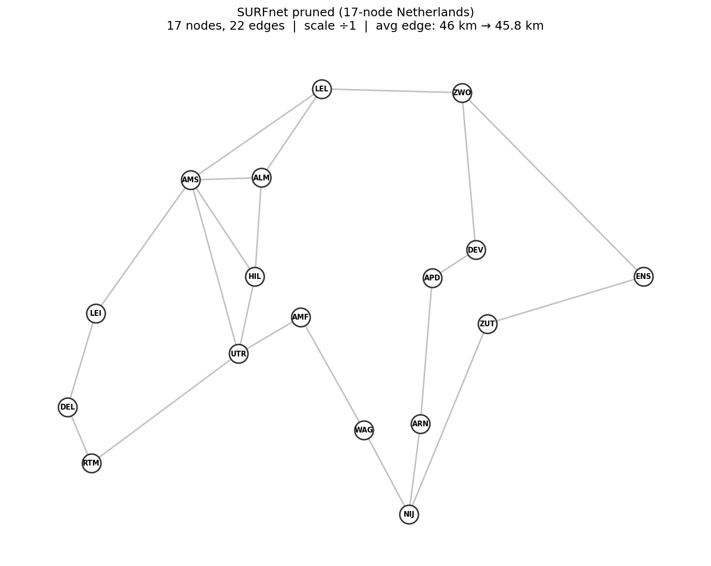
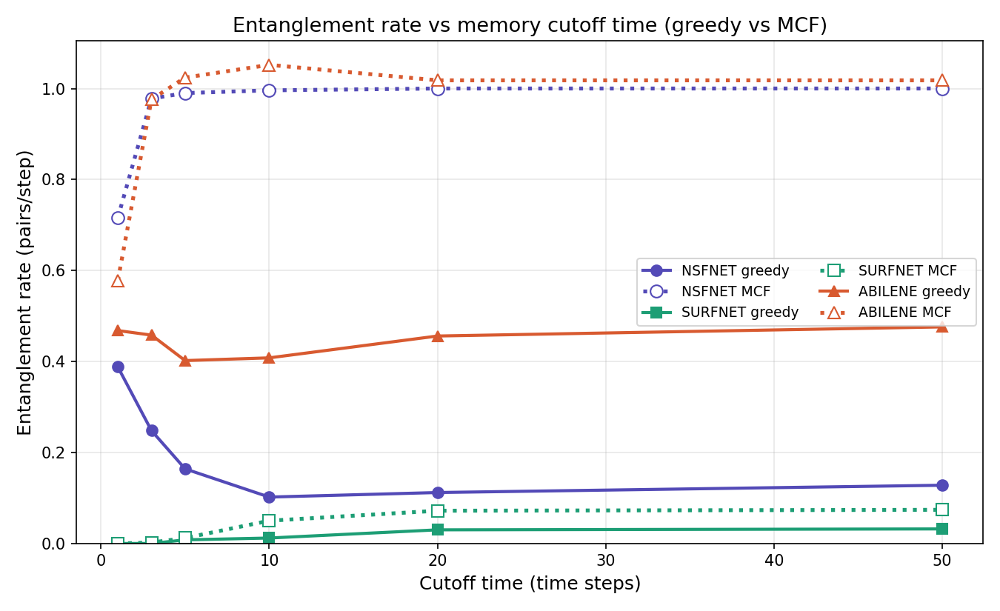
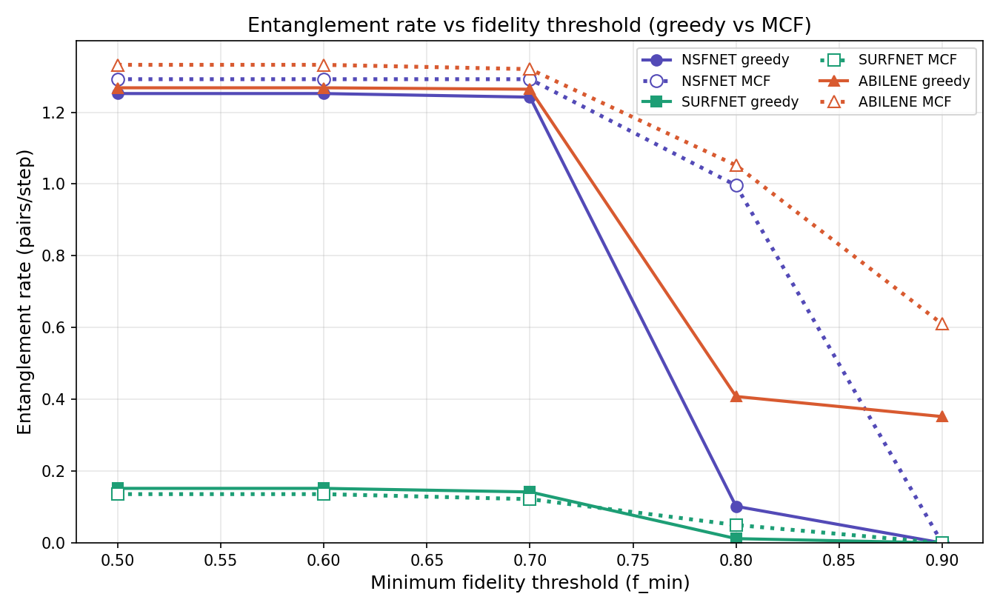
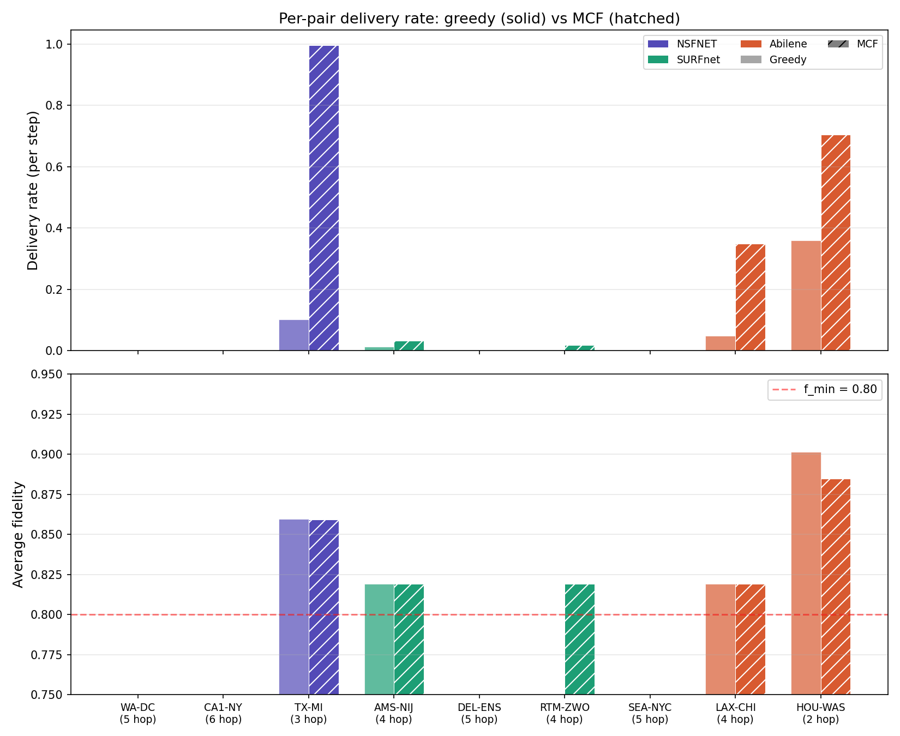

# Quantum Network Entanglement Routing Simulator

A discrete-time simulation framework for concurrent multi-user entanglement routing and resource allocation in quantum networks.

## Overview

This project investigates how routing decisions affect entanglement distribution when multiple source–destination pairs compete for shared quantum network resources. It compares a sequential **greedy shortest-path algorithm** with a **multi-commodity flow (MCF) formulation** that jointly allocates available entanglement across users.

The simulator models probabilistic, distance-dependent Bell-pair generation, finite storage lifetimes, and fidelity reduction during entanglement swapping. Experiments evaluate aggregate and per-user delivery rates and the fidelity of delivered pairs on NSFNET, a pruned SURFnet topology, and Abilene.

The study builds on the single-pair entanglement-distribution setting examined by [Vardoyan et al., *On the Bipartite Entanglement Capacity of Quantum Networks* (IEEE TQE, 2024)](https://arxiv.org/abs/2307.04477), extending the investigation to concurrent user pairs. Its contribution is a focused simulation-based comparison of routing strategies under shared resource and fidelity constraints.

## Quick Start

Run the following commands from the repository root. The two example simulations use NSFNET with link distances divided by 100 and a duration of 500 time steps.

```bash
# Install
pip install -e .

# Run a simulation
python main.py -t nsfnet -a greedy --distance-scale 100 -T 500 -o results/nsfnet_greedy.json
python main.py -t nsfnet -a mcf --distance-scale 100 -T 500 -o results/nsfnet_mcf.json

# Generate topology diagrams
python scripts/plot_topologies.py

# Generate all comparison plots
python scripts/plot_results.py

# Run tests
pytest tests/ -q
```

The simulation commands write JSON results to the specified output paths. The comparison figures below summarize experiments across all three topologies, including parameter sweeps and per-pair comparisons.

## Network Topologies

Each network is represented as an undirected graph: nodes are quantum repeater stations, and edges are optical fiber links with specified lengths. Distance scaling changes generation probabilities while preserving graph connectivity.

| Topology | Nodes | Edges | Distance configuration in the reported experiments |
|---|---:|---:|---|
| NSFNET | 14 | 21 | U.S. backbone; original link lengths divided by 100 |
| Abilene | 11 | 14 | U.S. backbone; original link lengths divided by 100 |
| SURFnet, pruned | 17 | 22 | Dutch research network; original link lengths retained |

Scaling brings the continental-scale links in NSFNET and Abilene into an approximate range of 2.5–23 km. SURFnet uses unscaled lengths of approximately 15–78 km, producing a more resource-constrained generation regime under the same attenuation model. Comparisons between topologies therefore reflect both network structure and the chosen distance configurations.

| NSFNET | Abilene |
|:---:|:---:|
|  |  |
| 14 nodes, 21 edges | 11 nodes, 14 edges |

| SURFnet, pruned |
|:---:|
|  |
| 17 nodes, 22 edges |

Three user pairs request entanglement concurrently in each topology. The order below is also the fixed service order used by the greedy algorithm.

| Topology | First pair | Second pair | Third pair |
|---|---|---|---|
| NSFNET | WA–DC | CA1–NY | TX–MI |
| Abilene | SEA–NYC | LAX–CHI | HOU–WAS |
| SURFnet | AMS–NIJ | DEL–ENS | RTM–ZWO |

## Simulation Model and Workflow

The Python implementation uses NetworkX for graph operations and `scipy.optimize.milp` for MCF optimization. A `QuantumNetwork` object maintains the physical topology and a dynamic list of stored entangled pairs on each edge, including their ages and fidelities. A `SimConfig` dataclass centralizes simulation parameters and supports reproducible runs with a fixed random seed.

Each discrete time step comprises four phases:

1. **Link generation.** Every edge independently attempts to generate one Bell pair. Generation attempts occur in parallel, and successful pairs enter storage with fidelity `F_init`.
2. **Memory aging and expiration.** Stored pairs are aged, and pairs older than `T_cut` are discarded. Memory loss is represented by a deterministic cutoff; continuous fidelity decay during storage is not included in the reported model.
3. **Routing and allocation.** The selected algorithm chooses paths using the currently available entanglement resources. Greedy allocation proceeds sequentially; MCF considers all user pairs jointly.
4. **Swapping and delivery.** Stored pairs along selected paths are consumed, using the highest-fidelity available resources first. Sequential entanglement swaps establish an end-to-end pair, which counts as a successful delivery only when its fidelity meets `F_min`.

For an edge of length $L_e$, the generation probability is

$$
p_{\mathrm{gen}}(e) = p_{\mathrm{gen\_base}}\exp\left(-\frac{L_e}{L_{\mathrm{att}}}\right).
$$

Entanglement swapping combines two input fidelities using the depolarizing model

$$
F_{\mathrm{out}} = F_1F_2 + \frac{(1-F_1)(1-F_2)}{3},
$$

applied sequentially along each route. The reported experiments use deterministic swap success (`q_swap = 1.0`), no additional gate errors, and instantaneous, cost-free classical communication with complete knowledge of the current entanglement state.

## Routing Algorithms

### Greedy Shortest-Path Routing

Greedy routing processes user pairs in the fixed order listed above. For each pair, it computes a shortest path on the active subgraph using edge costs of `-log(F)`, where `F` is the available link fidelity. This weighting favors paths with a larger product of link fidelities.

Allocated resources are consumed before the next user pair is considered. A selected route can still fail the end-to-end fidelity requirement after swapping, so resource consumption does not necessarily yield a successful delivery. Sequential allocation also makes performance sensitive to service order and competition for shared links.

### Multi-Commodity Flow Optimization

The MCF implementation uses a path-based integer linear program (ILP). At each routing step, it:

1. Enumerates up to 10 candidate paths for each source–destination pair.
2. Removes candidates whose predicted end-to-end fidelity is below `F_min`.
3. Jointly selects paths to maximize the number of deliveries, subject to available edge capacities and at most one selected path per user pair.

This formulation coordinates allocation across users and avoids selecting candidate routes that fail the fidelity constraint. Optimization is restricted to the enumerated candidates and the current time step; it does not establish a global optimum over all possible paths or future network states. Maximizing total deliveries also does not guarantee equal service across users or maximum average delivered fidelity.

## Parameters

| Parameter | Default | Description |
|---|---|---|
| `L_att` | 22 km | Fiber attenuation length in the generation-probability model |
| `p_gen_base` | 1.0 | Base entanglement-generation probability before distance attenuation |
| `T_cut` | 10 | Memory cutoff, in simulation time steps |
| `F_init` | 0.95 | Initial fidelity of a newly generated Bell pair |
| `F_min` | 0.80 | Minimum end-to-end fidelity required for a successful delivery |
| `q_swap` | 1.0 | Entanglement-swap success probability |

## Evaluation Methodology

The reported experiments run for **500 time steps with random seed 42**, holding all parameters fixed except the parameter being swept.

| Experiment | Values varied | Fixed comparison setting |
|---|---|---|
| Memory-cutoff sweep | `T_cut ∈ {1, 3, 5, 10, 20, 50}` | `F_min = 0.80` |
| Fidelity-threshold sweep | `F_min ∈ {0.50, 0.60, 0.70, 0.80, 0.90}` | `T_cut = 10` |
| Per-pair comparison | Individual source–destination pairs | `T_cut = 10`, `F_min = 0.80` |

Performance is measured using:

- **Entanglement delivery rate:** successful end-to-end deliveries divided by the number of simulation time steps, reported both in aggregate and for individual user pairs.
- **Average delivered fidelity:** the mean fidelity of successfully delivered pairs. This metric is conditional on successful delivery; a pair with no deliveries has no measured delivered-fidelity average.

Rates are expressed in pairs per simulation time step. The reported results do not assign a physical duration to a time step.

## Results and Interpretation

### Memory-Cutoff Sweep



On the scaled NSFNET and Abilene networks, MCF achieves higher delivery rates than greedy across the tested cutoff values. The plotted MCF rates increase over the shortest cutoffs and then approach approximately one pair per step. Both algorithms remain below approximately 0.08 pairs per step on unscaled SURFnet.

NSFNET greedy performance falls substantially between the shortest and intermediate cutoffs and remains low at longer cutoffs. Longer storage therefore does not produce a monotonic throughput improvement for this policy. The report proposes that accumulated resources may be consumed on routes that fail the fidelity requirement, but this explanation has not been verified mechanistically.

### Fidelity-Threshold Sweep



At thresholds up to `F_min = 0.70`, both algorithms achieve similar rates of approximately 1.25–1.3 pairs per step on the scaled U.S. topologies. Raising the threshold to `0.80` sharply reduces viable delivery opportunities, with MCF retaining substantially higher throughput than greedy in these configurations.

At `F_min = 0.90`, NSFNET and SURFnet rates approach zero, while the plotted Abilene results retain nonzero throughput. Thus, the effect of a stricter threshold depends on the available path lengths and cannot be described as a uniform collapse across all topologies.

SURFnet remains at approximately 0.15 pairs per step or below throughout the sweep, and greedy slightly outperforms MCF at some thresholds. This observation limits any claim of universal MCF superiority. Resource scarcity is a plausible contributing factor, but the report does not establish the cause of the reversal.

### Per-Pair Delivery and Fidelity



At the default threshold, gains are concentrated among pairs with sufficiently short routes. The report gives approximate rates of 0.1 versus 1.0 pairs per step for greedy and MCF on NSFNET's TX–MI pair, and 0.37 versus 0.70 on Abilene's HOU–WAS pair.

MCF's higher delivery rate does not always coincide with higher average fidelity. For HOU–WAS, the reported average is approximately 0.885 under MCF and 0.901 under greedy. Occasional use of longer alternate routes is a proposed explanation, rather than a confirmed mechanism.

Hop count is a binding constraint under the default fidelity model. With `F_init = 0.95`, sequential swapping yields approximately 0.819 fidelity over four hops and 0.781 over five hops. Consequently, paths longer than four hops cannot satisfy `F_min = 0.80` under these assumptions, irrespective of the routing strategy. This accounts for the lack of usable deliveries on geographically separated pairs such as WA–DC, CA1–NY, SEA–NYC, and DEL–ENS.

## Scope and Limitations

These experiments demonstrate topology- and parameter-dependent behavior under an idealized routing model. The fixed seed and 500-step runs support reproducibility, but do not by themselves establish statistical robustness across independent trials.

Several modeling choices limit generalization:

- **Pair selection:** geographically separated endpoints make several requests infeasible at the default fidelity threshold. Aggregate gains can therefore be dominated by a small number of short, feasible pairs.
- **Distance configuration:** scaled U.S. networks and unscaled SURFnet operate in different link-generation regimes, so their rate differences cannot be attributed to topology alone.
- **Hardware and control assumptions:** deterministic swaps, no additional gate errors, cutoff-based storage loss, and instantaneous global state information provide optimistic operating conditions.
- **Optimization scope:** the candidate-path limit and per-step throughput objective constrain what MCF optimizes; fairness and long-term resource planning are not explicit objectives.

Further evaluation could vary random seeds and user-pair selections, examine more two- and three-hop requests, introduce probabilistic swaps and imperfect gates, model continuous storage decoherence and classical signaling delays, and derive application-level measures such as secret-key rates.

## Project Structure

```text
quantum_routing/
├── quantum_routing/
│   ├── network.py              # QuantumNetwork: topology + link state
│   ├── simulation.py           # Main simulation loop
│   ├── algorithms/
│   │   ├── greedy_shortest_path.py
│   │   └── multi_commodity_flow.py
│   ├── topologies/
│   │   ├── nsfnet.py
│   │   ├── surfnet.py
│   │   └── abilene.py
│   └── utils/
│       ├── config.py
│       └── fidelity.py
├── scripts/
│   ├── plot_topologies.py
│   └── plot_results.py
├── tests/
├── paper/
├── main.py
└── README.md
```

The test suite covers topology construction, fidelity calculations, and routing algorithms. The `paper/` directory contains the accompanying research material.

## References

- Vardoyan et al., “On the Bipartite Entanglement Capacity of Quantum Networks,” *IEEE Transactions on Quantum Engineering*, 2024. [arXiv:2307.04477](https://arxiv.org/abs/2307.04477).
- Pouryousef et al., “Resource Placement for Rate and Fidelity Maximization in Quantum Networks,” *IEEE Transactions on Quantum Engineering*, 2024. [arXiv:2308.16264](https://arxiv.org/abs/2308.16264).
